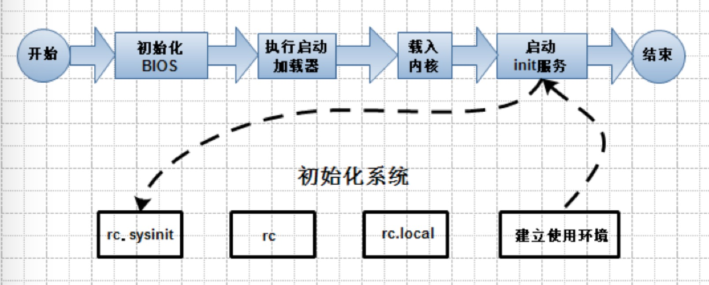

## 基础进阶

#### 1.1 系统选择

- centos debian
	
- 磁盘和分区
	
	
		
		磁盘分区的设备名
		
		在Linux中用户用设备名来访问设备，磁盘也不例外。
		
		磁盘设备名称如下：
		
			系统的第一块IDE接口的硬盘称为/dev/hda以此类推。分区则使用数字编号表示。如：/dev/hda1  /dev/hdb2
			
			数字编号1~4留给主分区或扩展分区使用，逻辑分区编号从5开始
			
			SAS/SCSI/SATA/USB接口硬盘的名称均以/dev/sd[a-p]表示
			
			
			注意：数字编号1—4是留给主分区或扩展分区使用，逻辑分区编号从5开始
		
	

- 高扩展企业分区方案：

		
		/boot     200MB
		
		/         50GB
		
		/var	  20GB
		
		swap      2048
		
		/usr      100GB   /usr/local 编译安装软件目录
		
		/home     100GB
		
		/ 和 swap最重要必须得存在
		

- 进入字符模式的方法
	
		
		
		- 图形环境下 右键 终端
		
		- 系统启动后进入字符模式 init 3
		
		- 远程telnet明文 ssh密文 登录字符模式
			
			telnet ip/主机名
			
			ssh user@ip/主机名
			
			logout 登出
			
			exit   退出
			
			
			#      为root用户
			
			$      为普通用户
			
			su     普通用户 切换  root用户
			
		0      系统关机状态
		
		1 	   单用户工作状态    用于维护
		
		2      多用户模式   NFS未启动
		
		3      多用户模式   字符界面
		
		4      系统未使用   留给用户自定义
		
		5      多用户模式   图形化界面
		
		6      所有进程被终止  重写启动
		
		查看当前系统的运行级别
		
			runlevel 
			
		切换运行级别
		
			init 3
			
		
		linux目录结构
		
			/boot
		
			/bin
			
			/sbin
			
			/usr    Unix System Resource，即Unix系统资源的缩写
			
			/etc    配置文件目录
			
			/lib    库文件 内核模块 目录
			
			/var    
			
			/home
			
			/opt    第三方软件存放目录
			
			/dev    设备目录
			
			/media  挂载目录
			
			/mnt    临时文件挂载点目录
			
			/proc   以文件系统的方式为访问系统内核数据的操作提供接口  内核2.4 2.6适用       proc文件系统
			
			/sys    以文件系统的方式为访问系统内核数据的操作提供接口  内核2.6适用           sysfs文件系统
			
			/dev  /var/run /var/lock 程序访问共享内存资源时候使用的文件系统              tmpfs文件系统
			
			/proc/bus/usb   访问usb设备时候使用文件系统                                usbfs文件系统
			
			/dev/pts        内核用来和为终端进行交互文件系统                            devpts文件系统
			
			swap            内核使用的特殊文件系统 无挂载点      用来创建虚拟内存
		
		

- 远程登陆

		
		Linux下远程登录另一台Linux服务器
		
			Linux下的ssh命令是OpenSSH的客户端程序。要登陆远程Linux系统
		
			必须保证远程Linux系统上启动了OpenSSH服务器
		
		使用ssh命令登陆远程OpenSSH服务器的命令格式是：
		
			$ssh  远程主机上的用户名@远程主机的ip地址或主机名
		
			$ssh   IP地址
		
		
		Windows下利用SSH工具登录一台linux服务器 两个软件:
		
			SecureCRT
		
			xshell
			
			 
	

- 命令
	
		
		.      当前目录
		
		..     父目录
		
		~      家目录
		
		-      上一个目录
		
		cd     切换
		
		pwd
		
		ls  [参数]   [目录名]
			
			参数：
				
				-a：显示所有文件，包括隐藏文件(以.开头的文件)
				
				-l：以长格式显示
				
				-t：按修改时间先后显示
				
				-R：显示目录及下级子目录结构（递归）
				
				-m:  横向输出文件名，并以“，”作分格符。 
				
				-S:  以文件大小排序
				
			用颜色代表不同文件
				
				白色：   普通文件
				
				红色：   压缩文件
				
				蓝色：   目录文件
				
				浅蓝色： 链接文件
				
				黄色：   设备文件（/dev）
				
				绿色：   可执行文件（/bin、/sbin）
				
				粉红色： 图片文件
				 
		mkdir
		
		rmdir  删除目录
		
		rm -rf  删除文件和文件夹
		
		tree  显示文件和目录树
			
			用法：  tree    [参数]   {文件}
			
			参数：  
				
				-a   不隐藏任何以.字符开始的条目
			   
			    -d   只显示目录不显示文件
			   
			    -f    每个文件都显示路径
			  
			    -t   根据最后修改时间排序
			  
			    -L n 只显示n层目录 （n为数字）
			
		
		touch 创建空文件和更改时间戳
			
			用法：touch  [参数]   {文件}
			
			参数：   -d    更改时间戳为定义值   （后面加年月日，格式：20101212）
			
		
		cp -r source  target
		
			用法： cp  [参数]   {原文件…}  {目标文件}
			
			
			参数：  -r  递归执行  （可复制目录树）
			
		
		mv   移动和重命名文件
			
			用法： mv  [参数]  {原文件} {目标文件}     把原文件更名为目标文件
			
			mv  [参数]  {原文件…} {目标文件}    把一个或多个文件同时移动到目标文件中
			
		
		cat  显示文件内容
			
			由第一行开始显示文件的内容 
			
			cat命令显示文件时会同时显示所有内容
			
			大型文件在屏幕上一晃而过，难以阅读。所以他比较适合小于一屏的文件
			
		
		tac  从最后一行开始显示文件内容
		
		file 显示文件类型
		
		more 一页一页的显示档案内容
		
			空格键 (space)：代表向下翻一页
			
			Enter：代表向下翻『一行』
			
			/字符串：代表在这个显示的内容当中，向下搜索『字符串』这个关键词
			
			:f ：立刻显示出文件名以及目前显示的行数
			
			h 帮助
			
			b 或 [ctrl]-b ：代表往回翻页 
			
			q：退出 
		
		less 与 more 类似，less可以往前翻页
		
			空格键：向下翻一页
			
			[pagedown]：向下翻一页
			 
			[pageup]：向上翻一页
			
			/字符串：向下搜索『字符串』
			
			?字符串 ：向上搜索『字符串』
			
			n：重复前一个搜索 
			
			N：反向的重复前一个搜索
			
			h：帮助
			
			q：退出
		
		head  显示文件开始几行
			
			head [options]  {file…}
			
			参数 ：  –n  number查看前几行的值
		
		tail  显示文件最后几行
		
			tail  [options]  {file…}
			
			参数 ：  –n  number 查看后几行的值
			
		
		man   显示命令帮助内容
		
		shutdown  将数据同步到硬盘后 才关机
			
			 -t  sec ：送出警告信息和删除信息之间要延迟多少秒
			 
			- k：并不真正关机而只是发出警告信息给所有用户
			
			- r：关机后立即重新启动
			
			- h：关机后停止系统
			
		
		sync  将数据同步写入硬盘
		
		init 0  关机
		
		reboot/init 6 重启
		
		alias 别名='命令 参数'
		
		find  发现
			
			find [PATH] [option] [action] 
			
			选项与参数
			
			1. 不时间有关的选项：共有 -atime, -ctime 与 -mtime ，以 -mtime 说明 
			
			   -mtime  n ：n 为数字，意义为在 n 天之前的『一天之内』被更改过内容的文件
			   
			   -mtime +n ：列出在 n 天之前(不含 n 天本身)被改动过内容的文件
			   
			   -mtime -n ：列出在 n 天之内(含n 天本身)被更改过内容的文件
			   
			   -newer file ：file 为一个存在参照物，列出比 file 还要新的文件
			   
			find / -mtime 0 
			 
			# 那个 0 是重点！0 代表目前的时间，所以，从现在开始到 24 小时前，有改动过内容的文件都会被列出来
			
			find / -mtime 3  #3天内改动过的文件
			
			find / -name file –exec ls –l {} \;
			
				# 上面命令中 {} 代表find查询结果
				
				#  \ 反斜杠是转义  
			
			文件的 Access time，atime 是在读取文件或者执行文件时更改的
			
			文件的 Modified time，mtime 是在写入文件时随文件内容的更改而更改的
			
			文件的 Create time，ctime 是在写入文件、更改所有者、权限或链接设置时随 Inode 的内容更改而更改的
			
				ls -lc filename 列出文件的 ctime
			
				ls -lu filename 列出文件的 atime
			
				ls -l filename 列出文件的 mtime
			
			
		history  命令历史
		
		环境变量 PATH
		
			export PATH=path:$PATH
		
		grep
			
			-c 只输出匹配行的计数
			
			-i 不区分大小写（只适用于单字符
			
			-h 查询多文件时不显示文件名
			
			-l 查询多文件时只输出包含匹配字符的文件名
			
			-n 显示匹配行及行号
			
			-s 不显示不存在或无匹配文本的错误信息
			
			-v 显示不包含匹配文本的所有行
		
		sort -r 反向排序
		
		cut –d ‘分割符’ –f 取第几段
		
		uniq –c 计数
		
		wc –l 统计多少行
		
		
	
	

- linux正则

		
		&&且
		
		||或
		
		基本概念
		
			1.基本正则表达式   扩展的正则表达式  （由普通字符+元字符组成）
			
			2.通配 （由普通字符+元字符组成）
			
			3.元字符
				
				注意：正则表达式中元字符的意义和通配中元字符的意义有区别的
				
				bash shell本身不支持正则表达式，使用正则表达式的是shell的一些命令和工具，如grep,sed,awk等等
				
				但是bash可以使用正则表达式中的一些元字符实现通配的功能，此时的这些元字符叫通配符。
				
				此时通配中元字符的意义跟正则表达式中元字符的意义就不一样了。
				
			通配是指：将一个包含通配符的非具体的文件名扩展为计算机，服务器，网络上的一批具体的文件名的过程。
			
			基本正则表达式中元字符的意义如下：
				
				1.  * 匹配*前面的那一个字符的0次或多次
					
					如hel*o   heo  helo  hello  helllo 
					
				2. . 匹配任意一个字符（只匹配一个，可以是空格）
				
					如ab.    abc abd  ab3 ab 
					
				3. ^  匹配行首，行首的字符序列必须是^后的字符序列
					
					如^suda  sudahuhuhuuuuuhuuh sudaokokokokokoko 
				
				4. & 匹配行尾，行尾的字符序列必须是$前的字符序列
					
					如suda$  jijijijijiiijijsuda  lkokokokokjijhuhsuda 
					
					特殊的 ^$    匹配一个空行
					
					      ^.$   匹配只有一个字符的空行
					
				5. [] 匹配字符集合中的任意一个字符（只匹配一个）
				
					如[1234] [1-4] 匹配1，2，3，4的任意一个字符
					
					注意：^放在[]里面时，不再表示匹配行首，而是取反的意思
					
						[^1234]  [^1-4]  匹配不是1，2，3，4的任意一个字符
					
					[a-z][A-Z]* 匹配任意一个英文单词
				
				6. \ 用于转义元字符，使之成为普通字符
					
					如\*   此时*表示一个普通字符				
					
				7. \<\> 用于精确匹配
					
					如\<the\>  表示精确匹配the这个单词，而不是them then等等
						
				8. \{\}系列符号
					
					\{n\}          匹配前面字符的n次
					
					\{n,\}		   匹配前面字符的至少n次
					
					\{n,m\}		   匹配前面字符的n-m次，至少n次，至多m次
					
					如JO\{3\}B	   匹配JOOOB
					
					如JO\{3,\}B	   匹配JOOOB  JOOOOB 
					
					如JO\{3,6\}B   匹配JOOOB  JOOOOB JOOOOOB   JOOOOOOB
					
					扩展的正则表达式中元字符的意义如下：
					
					1. ？ 匹配前面的那一个字符的0次或1次
						
						如JO?B 匹配  JB JOB JOOB
					
					2. + 匹配前面的那一个字符的1次或多次
						
						如JO+B 匹配  JOOB  JOOOB 
						
					3. | 与（）通常结合使用，表示一组可选的字符集合
					
						如re(a|o|e)d 匹配read  reod  reed
						
						等同于re[aoe]d
						
						
						
					通配中的元字符的意义如下：
							
						1. *  表示任意多的任意字符
							
						2. ?  表示一个任意字符
							
						3. ^  表示取反
							
						4. [] 同正则表达式的用法
							
						5. {} 表示一组表达式的集合   {}中表达式是或的关系
							
							如ls -l  {*.cpp , [1234]*.c}
								
							列出满足表达式*.cpp或者[1234]*.c的文件。
		
		

- 服务管理

		
		启动第一步－－加载BIOS
		
			当你打开计算机电源，计算机会首先加载BIOS信息，BIOS信息是如此的重要
		
			以至于计算机必须在最开始就找到它。这是因为BIOS中包含了CPU的相关信息
			
			设备启动顺序信息、硬盘信息、内存信息、时钟信息、PnP特性等等。在此之后
			
			计算机心里就有谱了，知道应该去读取哪个硬件设备了。
			
		启动第二步－－读取MBR
		
			众所周知，硬盘上第0磁道第一个扇区被称为MBR，也就是Master Boot Record，即主引导记录，它的大小是512字节
			
			别看地方不大，可里面却存放了预启动信息、分区表信息。
			
			系统找到BIOS所指定的硬盘的MBR后，就会将其复制到0×7c00地址所在的物理内存中。
			
			其实被复制到物理内存的内容就是Boot Loader，而具体到你的电脑，那就是lilo或者grub了。
			
		启动第三步－－Boot Loader
		
			Boot Loader 就是在操作系统内核运行之前运行的一段小程序。
			
			通过这段小程序，我们可以初始化硬件设备、建立内存空间的映射图，从而将系统的软硬件环境带到一个合适的状态，
			
			以便为最终调用操作系统内核做好一切准备。
			
			Boot Loader有若干种，其中Grub、Lilo和spfdisk是常见的Loader。
			
			我们以Grub为例来讲解吧，毕竟用lilo和spfdisk的人并不多。
			
			系统读取内存中的grub配置信息（一般为menu.lst或grub.lst），
			
			并依照此配置信息来启动不同的操作系统。
			
		启动第四步－－加载内核
			
			根据grub设定的内核映像所在路径，系统读取内存映像，并进行解压缩操作。
			
			此时，屏幕一般会输出“Uncompressing Linux”的提示。
			
			当解压缩内核完成后，屏幕输出“OK, booting the kernel”。
			
			系统将解压后的内核放置在内存之中，并调用start_kernel()函数来启动一系列的初始化函数并初始化各种设备，
			
			完成Linux核心环境的建立。至此，Linux内核已经建立起来了，基于Linux的程序应该可以正常运行了。
			
		启动第五步－－用户层init依据inittab文件来设定运行等级
			
			内核被加载后，第一个运行的程序便是/sbin/init，该文件会读取/etc/inittab文件，并依据此文件来进行初始化工作。
			
			其实/etc/inittab文件最主要的作用就是设定Linux的运行等级，
			
			其设定形式是“：id:5:initdefault:”，这就表明Linux需要运行在等级5上。Linux的运行等级设定如下：
			0：关机
			1：单用户模式
			2：无网络支持的多用户模式
			3：有网络支持的多用户模式
			4：保留，未使用
			5：有网络支持有X-Window支持的多用户模式
			6：重新引导系统，即重启
		
		启动第六步－－init进程执行rc.sysinit
			
			在设定了运行等级后，Linux系统执行的第一个用户层文件就是/etc/rc.d/rc.sysinit脚本程序，
			
			它做的工作非常多，包括设定PATH、设定网络配置（/etc/sysconfig/network）、
			
			启动swap分区、设定/proc等等。
			
			如果你有兴趣，可以到/etc/rc.d中查看一下rc.sysinit文件，里面的脚本够你看几天的。
			
		启动第七步－－启动内核模块
			
			具体是依据/etc/modules.conf文件或/etc/modules.d目录下的文件来装载内核模块。
			
		启动第八步－－执行不同运行级别的脚本程序
			
			根据运行级别的不同，系统会运行rc0.d到rc6.d中的相应的脚本程序，来完成相应的初始化工作和启动相应的服务。
			
			具体位置：/etc/rc.d/
			
		启动第九步－－执行/etc/rc.d/rc.local
			
			你如果打开了此文件，里面有一句话，读过之后，你就会对此命令的作用一目了然：
			
			# This script will be executed *after* all the other init scripts
			
			# You can put your own initialization stuff in here if you don’t
			
			# want to do the full Sys V style init stuff.
			
			rc.local就是在一切初始化工作后，Linux留给用户进行个性化的地方。你可以把你想设置和启动的东西放到这里。
			
		启动第十步－－执行/bin/login程序，进入登录状态
			
			
			此时，系统已经进入到了等待用户输入username和password的时候了，你已经可以用自己的帐号登入系统了。
			
			漫长的启动过程结束了，一切都清静了…
		
		
		
	
	

- 服务介绍
	
		
		在开始介绍如何管理Linux的服务前，先为你介绍Linux的服务究竟有哪些。
		这些服务的分类方法，以及一些关于服务的基本概念
		
		服务的种类
		
			Linux提供了许多的服务。这些服务，可以使依照其功能和依照服务启动的方法与执行时的特性进行分类。
		
		
		依照功能分类:
		
			系统服务
				
				某些服务的服务对象是Linux系统本身，或者Linux系统用户，这类的服务我们称为系统服务（System Service）
			
			网络服务
			
				提供给网络中的其他客户端（Clients）调用使用的服务，这类的服务我们统称为网络服务（Networking Service)
				
		依照服务启动的方法分类:
			
			独立系统服务
				
				服务一经启动，除非因为关闭系统或者管理者手动结束，否则都将在后台执行
				
				不管有没有被用到。这样的服务我们称为独立系统服务(Standalone Service)
				
				独立系统服务有时候又被称为Sys V服务 （Sys V Service）
			
			临时服务
		  	
			与独立系统服务不同，临时服务（Transient Service）平时并不会启动，
			
			而是当客户端需要时才会被启动，使用完毕会结束。
		   
			
			
		服务的管理
			
			手动的启动或停止独立系统服务
			
			为了简化Linux服务管理的麻烦，Linux特别为每一个独立式的服务，提供了一个服务启动程序文件（Service Startup Script）。
			
			所有的服务启动文件被储存在/etc/rc.d/init.d/目录下
			
		如何利用脚本直接管理服务
			
			/etc/rc.d/init.d/里面每一个文件就是某一个服务的启动程序文件，你可以直接执行某一个启动程序文件，借以来启动或者停止该服务
			
		不同的服务启动文件可能会有不同的动作参数：
			
		-	start：	    启动这个服务
		
		-	stop：		停止这个服务
		
		-	restart：	先停止，再启动，也就是重新启动的意思
		
		-	reload：	重载配置文件，这个参数只有在服务已经启动的状况下才能使用
		
		-	condrestart：有条件的重新启动，这个服务必须是已经启动的，才会被重新启动；如果这个服务尚未启动，则无须启动之
		
		-	status：	查看目前服务的启动状态
		
		service命令管理方法
		
			用法： service    filename   action
			
			动作参数：
			
				start
				
				stop
				
				restart
				
				reload
				
				status
		
		
		守护进程
			
			inetd是一个特殊的程序，不断监控所有通讯端口。
			
			一旦有客户端调用某一个启动文件时，
			
			这个程序就要负责启动该服务；而在客户端使用完毕后，改程序也必须要负责结束。
			
			守护进程服务位置：/etc/xinetd.d
			
			service    xinetd    start/stop/status
		
		
		服务的自启动
			
			chkconfig命令主要用来更新（启动或停止）和查询系统服务的运行级信息。
			
			谨记chkconfig不是立即自动禁止或激活一个服务，它只是简单的改变了符号连接。
			
			使用语法：
				
				chkconfig [--add][--del][--list][系统服务] 
				
				或 
				
				chkconfig [--level <等级代号>][系统服务][on/off/reset]
			
			参数用法：
				
				--add 　增加所指定的系统服务，让chkconfig指令得以管理它，并同时在系统启动的叙述文件内增加相关数据。
				
				--del 　删除所指定的系统服务，不再由chkconfig指令管理，并同时在系统启动的叙述文件内删除相关数据。
				
				--level<等级代号> 　指定读系统服务要在哪一个执行等级中开启或关毕。
				
				等级0表示：表示关机
				
				等级1表示：单用户模式
				
				等级2表示：无网络连接的多用户命令行模式
				
				等级3表示：有网络连接的多用户命令行模式
				
				等级4表示：不可用
				
				等级5表示：带图形界面的多用户模式
				
				等级6表示：重新启动
				
			需要说明的是，level选项可以指定要查看的运行级而不一定是当前运行级。
			
			对于每个运行级，只能有一个启动脚本或者停止脚本。当切换运行级时，
			
			init不会重新启动已经启动的服务，也不会再次去停止已经停止的服务。
			
			chkconfig --list [name]：显示所有运行级系统服务的运行状态信息（on或off）。
			
			如果指定了name，那么只显示指定的服务在不同运行级的状态。
			
			chkconfig --add name：增加一项新的服务。
			
			chkconfig确保每个运行级有一项启动(S)或者杀死(K)入口。
			
			如有缺少，则会从缺省的init脚本自动建立。
			
			chkconfig --del name：删除服务，并把相关符号连接从/etc/rc[0-6].d删除。
			
			chkconfig [--level levels] name：设置某一服务在指定的运行级是被启动，停止还是重置。
			
			使用范例：
				
				chkconfig --list #列出所有的系统服务
				
				chkconfig --add httpd #增加httpd服务
				
				chkconfig --del httpd #删除httpd服务
				
				chkconfig --list #列出系统所有的服务启动情况
				
				chkconfig --list mysqld #列出mysqld服务设置情况
				
				chkconfig --level 35 mysqld on #设定mysqld在等级3和5为开机运行服务，
				--level 35表示操作只在等级3和5执行，on表示启动，off表示关闭
				
				chkconfig mysqld on #设定mysqld在各等级为on，“各等级”包括2、3、4、5等级
		
		
		
		
		
		
		
		

- screen
	
		
		Screen被称之为一个全屏窗口管理器，用他可以轻松在一个物理终端上获得多个虚拟终端的效果
		
		Screen功能说明：
			
			简单来说，Screen是一个可以在多个进程之间多路复用一个物理终端的窗口管理器,
			
			这意味着你能够使用一个单一的终端窗口运行多终端的应用。Screen中有会话的概念，
			
			用户可以在一个screen会话中创建多个screen窗口，在每一个screen窗口中就像操作一个真实的telnet/SSH连接窗口那样。
			
		Screen命令语法：
			
			screen [-AmRvx -ls -wipe][-d < >][-h < >][-r < >][-s ][-S < >]
			
		Screen命令参数：
			
			-A -[r|R]	将所有的视窗都调整为目前终端机的大小。
			
			-c filename 用指定的filename文件替代screen的配置文件’.screenrc’.
			
			-d [pid.tty.host]  断开screen进程(使用该命令时，screen的状态一定要是Attached，
			
			也就是说有用户连在screen里)。一般进程的名字是以pid.tty.host这种形式表示(用screen -list命令可以看出状态)。
			
			
			-D [pid.tty.host]  与-d命令实现一样的功能，区别就是如果执行成功，会踢掉原来在screen里的用户并让他logout。
			
			-h < > 指定视窗的缓冲区行数。
			
			-ls或–list 显示目前所有的screen作业。
			
			-m	即使目前已在作业中的screen作业，仍强制建立新的screen作业
			
			-p number or name  预先选择一个窗口。
			
			-r [pid.tty.host]  恢复离线的screen进程，如果有多个断开的进程，需要指定[pid.tty.host]
			
			-R   先试图恢复离线的作业。若找不到离线的作业，即建立新的screen作业。
			
			-s shell 指定建立新视窗时，所要执行的shell。
			
			-S < >  指定screen作业的名称。(用来替代[pid.tty.host]的命名方式,可以简化操作).
			
			-v  显示版本信息。
			
			-wipe 检查目前所有的screen作业，并删除已经无法使用的screen作业。
			
			-x    恢复之前离线的screen作业
		
		Screen命令的常规用法:
			
			screen -d -r:连接一个screen进程，如果该进程是attached，就先踢掉远端用户再连接。
			
			screen -D -r:连接一个screen进程，如果该进程是attached，就先踢掉远端用户并让他logout再连接
			
			screen -ls或者-list:显示存在的screen进程，常用命令
			
			screen -m:如果在一个Screen进程里，用快捷键crtl+a c或者直接打screen可以创建一个新窗口,screen -m可以新建一个screen进程。
			
			screen -dm:新建一个screen，并默认是detached模式，也就是建好之后不会连上去。
			
			screen -p number or name:预先选择一个窗口。
		
		Screen实现后台运行程序的简单步骤:
			
			1< 要进行某项操作时，先使用命令创建一个Screen:
				
				[linux@user~]$ screen -S test1
			2<接着就可以在里面进行操作了，如果你的任务还没完成就要走开的话，使用命令保留Screen：
				
				[linux@user~]$ Ctrl+a+d
				
				 #按Ctrl+a，然后再按d即可保留Screen
				 
				 [detached]
				 
				 #这时会显示出这个提示，说明已经保留好Screen了
				 
				 如果你工作完成的话，就直接输入:
				 	[linux@user~]$ exit
					
					#这样就表示成功退出了
					
					[screen is terminating]
					
			3< 如果你上一次保留了Screen，可以使用命令查看：
				
				[linux@user~]$ screen -ls
				
				There is a screen on:
				
				9649.test1   (Detached)
		
		恢复Screen，使用命令：
			
			[linux@user~]$ screen -r test1 (or 9649)
		
		
		
		
		
		
		

- 进程管理
	
		
		程序和进程
			
			程序是为了完成某种任务而设计的软件，比如OpenOffice是程序。
			
			什么是进程呢？进程就是运行中的程序
			
			一个运行着的程序，可能有多个进程。 
			
				比如网站所用的WWW服务器是apache服务器，当管理员启动服务后，可能会有好多人来访问，
				
				也就是说许多用户来同时请求httpd服务，
				
				apache服务器将会创建有多个httpd进程来对其进行服务。
		
		进程分类；
			
			进程一般分为 
				
				交互进程
				
				批处理进程
				
				守护进程
				
		在Linux系统中，根据进程的特点，把进程可以分为三类：交互进程、批处理进程和守护进程。
		
		1. 交互进程：是由shell启动的进程，它既可以在前台运行，也可以在后台运行。交互进程在执行过程中，
		要求与用户进行交互操作。简单来说就是用户需要给出某些参数或者信息，进程才能继续执行。
		
		2.批处理进程：与windows原来的批处理很类似，是一个进程序列。该进程负责按照顺序启动其它进程。
		
		3.守护进程：是是执行特定功能或者执行系统相关任务的后台进程。守护进程只是一个特殊的进程，不是内核的组成部分。
		许多守护进程在系统启动时启动，直到系统关闭时才停止运行。而某些守护进程只是在需要时才会启动，
		比如FTP或者Apache服务等，可以在需要的时候才启动该服务。
		
		
		
		另外，根据进程状态的不同，又可以把进程分为另外三类：守护进程、孤儿进程和僵尸进程。
		
		1.守护进程：(补充):所有守护进程都可以超级用户(用户ID为0)的优先权运行；
		守护进程没有控制终端；守护进程的父进程都是init进程(即1号进程)。
		
		    但是，并非所有在后台运行的进程都是守护进程，因为我们可以使用符号“&”来使进程在后台运行。
			比如：./bin/process_test   &，执行该条命令后，相应的进程在后台运行。
			
		2.孤儿进程：一个父进程退出后，它的一个或多个子进程还在运行，那么这些子进程将成为孤儿进程。
		孤儿进程将被init进程所收养，并由init进程对它们完成状态收集工作。
			
		3.僵尸进程：一个子进程结束但是没有完全释放内存（在内核中的 task_struct没有释放），该进程就成为僵尸进程。
		
		   当僵尸进程的父进程结束后该僵尸进程就会被init进程所收养，最终被回收。
		   
		僵尸进程会导致资源的浪费，而孤儿进程不会。
		
		值得一提的是守护进程总是活跃的，一般是后台运行，
		
		守护进程一般是由系统在开机时通过脚本自动激活启动或超级管理用户root来启动。
		
		比如在Redhat中，我们可以定义httpd 服务器的启动脚本的运行级别，
		
		此文件位于/etc/init.d目录下，文件名是httpd，/etc/init.d/httpd 就是httpd服务器的守护程序，
		
		当把它的运行级别设置为3和5时，当系统启动时，它会跟着启动。
		
			# chkconfig  --level 35  httpd on
			
		
		由于守护进程是一直运行着的，所以它所处的状态是等待请求处理任务。
		
		比如，我们是不是访问网站  网站的httpd服务器都在运行，等待着用户来访问，也就是等待着任务处理。
		
		
		进程的属性；
			
			进程ID（PID)：是唯一的数值，用来区分进程；
		
			父进程和父进程的ID（PPID)；
			
			启动进程的用户ID（UID）和所归属的组（GID）；
			
			进程状态：状态分为运行R、休眠S、僵尸Z；
			
			进程执行的优先级；
			
			进程所连接的终端名；
			
			进程资源占用：比如占用资源大小（内存、CPU占用量）；
			
		父进程和子进程；
			
			他们的关系是管理和被管理的关系，当父进程终止时，子进程也随之而终止。但子进程终止，父进程并不一定终止。
			
			比如httpd服务器运行时，我们可以杀掉其子进程，父进程并不会因为子进程的终止而终止。
			
			在进程管理中，当我们发现占用资源过多，或无法控制的进程时，应该杀死它，以保护系统的稳定安全运行；
			
		进程管理
			
			对于Linux进程的管理，是通过进程管理工具实现的，比如ps、kill、pgrep等工具；
		
		ps 监视进程工具
			
			ps 为我们提供了进程的一次性的查看，它所提供的查看结果并不动态连续的；如果想对进程时间监控，应该用top工具；
		
		ps 的参数说明
			ps 提供了很多的选项参数，常用的有以下几个；
			
				l  长格式输出
				
				u  按用户名和启动时间的顺序来显示进程
				
				j  用任务格式来显示进程
				
				f  用树形格式来显示进程
				
				a  显示所有用户的所有进程（包括其它用户）
				
				x  显示无控制终端的进程
				
				r  显示运行中的进程
				
				ww 避免详细参数被截断
				
		我们常用的选项是组合是aux 或lax，还有参数f的应用
			
			ps aux 或lax输出的解释
		
				USER	进程的属主；
				PID		进程的ID；
				PPID    父进程；
				%CPU	进程占用的CPU百分比；
				%MEM	占用内存的百分比；
				PRI     代表这个程序『可被执行的优先级』
				NI	    进程的NICE值，数值大，表示较少占用CPU时间；
				VSZ     进程虚拟大小；
				RSS     驻留中页的数量；
				TTY     终端ID
				STAT    进程状态
				
					D    不间断的睡眠(usually IO)
					R    正在运行中在队列中可过行的； 
					S    处于休眠状态；
					T    停止或被追踪； 
					W    进入内存交换（从内核2.6开始无效）；
					X    死掉的进程（从来没见过）；
					Z    僵尸进程；
					
		<    优先级高的进程 
		N    优先级较低的进程 
		L    有些页被锁进内存； 
		s    进程的领导者（在它之下有子进程）；
		l    is multi-threaded (using CLONE_THREAD, like NPTL pthreads do)
		+    位于后台的进程组；
		
		WCHAN	正在等待的进程资源；
		START     启动进程的时间；
		TIME	进程消耗CPU的时间；
		COMMAND    命令的名称和参数；
		
		
		ps 应用举例
		
			实例一：ps aux 最常用
			
			[root@localhost ~]# ps -aux | more
			
			可以用 | 管道和 more 连接起来分页查看
			
			[root@localhost ~]# ps -aux  > ps001.txt
		
			[root@localhost ~]# more ps001.txt 
				
			这里是把所有进程显示出来，并输出到ps001.txt文件，然后再通过more 来分页查看
		
		实例二：和grep 结合，提取指定程序的进程；
		
			[root@localhost ~]# ps aux | grep httpd
		
			root  4187 0.0 1.3 24236 10272? Ss 11:55 0:00 
			
			/usr/sbin/httpd apach 4189 0.0 0.6 24368 4940 ? S 11:55 0:00 
			
			/usr/sbin/httpd apache  4190 0.0 0.6 24368 4932 ?  S 11:55 0:00 
			
			/usr/sbin/httpd apache 4191 0.0 0.6 24368 4932 ? S 11:55 0:00 
			
			/usr/sbin/httpd apache 4192 0.0 0.6  24368  4932 ? S 11:55 0:00 
			
			/usr/sbin/httpd apache 4193 0.0 0.6 24368 4932 ? S 11:55 0:00 
			
		
		
		实例二：父进和子进程的关系友好判断的例子
		
			 ps auxf  | grep httpd root 4484  0.0  0.0   5160   704 pts/3 S+   12:21   0:00 \_ grep httpd
		
		
		这里用到了f参数；父与子关系一目了然；
		
		pgrep
			
			pgrep 是通过程序的名字来查询进程的工具，
			
			一般是用来判断程序是否正在运行。
			
			在服务器的配置和管理中，这个工具常被应用，简单明了；
		
		用法：
			
			#pgrep 参数选项   程序名
			
		常用参数
			
			-l  列出程序名和进程ID；
			
			-o  进程起始的ID；
			
			-n  进程终止的ID；
		
		举例：
			
			pgrep -lo httpd
			4557 httpd
			
			pgrep -ln httpd
			4566 httpd
			
			
			pgrep -l httpd
			4557 httpd
			
			4560 httpd
		
		终止进程的工具 kill 、killall、pkill
		
			终止一个进程或终止一个正在运行的程序，一般是通过 kill 、killall、pkill、xkill 等进行。
			
			比如一个程序已经死掉，但又不能退出，这时就应该考虑应用这些工具
			
			另外应用的场合就是在服务器管理中，在不涉及数据库服务器程序的父进程的停止运行，也可以用这些工具来终止。
			
			为什么数据库服务器的父进程不能用这些工具杀死呢？原因很简单，这些工具在强行终止数据库服务器时，
			
			会让数据库产生更多的文件碎片，当碎片达到一定程度的时候，数据库就有崩溃的危险。
			
			比如mysql服务器最好是按其正常的程序关闭，而不是用pkill mysqld 或killall mysqld 这样危险的动作；
			
			当然对于占用资源过多的数据库子进程，我们应该用kill 来杀掉。
			
		kill
			
			kill的应用是和ps 或pgrep 命令结合在一起使用的；
		
		kill 的用法：
			
			kill ［信号代码］   进程ID
			
			注：信号代码可以省略；我们常用的信号代码是 -9 ，表示强制终止；
		举例：
			
			ps  auxf  |grep   httpd
			
			
			我们查看httpd 服务器的进程；您也可以用pgrep -l httpd 来查看
			
		我们看上面例子中的第二列，就是进程PID的列，其中4830是httpd服务器的父进程，从4833－4840的进程都是它4830的子进程；
		
		如果我们杀掉父进程4830的话，其下的子进程也会跟着死掉；
		
			kill 4840  注：杀掉4840这个进程
			ps -auxf  |grep  httpd  注：查看一下会有什么结果？是不是httpd服务器仍在运行？
			
			[root@localhost ~]# kill 4830   注：杀掉httpd的父进程；
			[root@localhost ~]# ps -aux |grep httpd  注：查看httpd的其它子进程是否存在，httpd服务器是否仍在运行？
			
			对于僵尸进程，可以用kill -9 来强制终止退出；
			
			比如一个程序已经彻底死掉，如果kill 不加信号强度是没有办法退出，
			
			最好的办法就是加信号强度 -9 ，后面要接杀父进程；比如；
			
			ps aux |grep gaim
			
		killall
			
			killall 通过程序的名字，直接杀死所有进程，咱们简单说一下就行了。
			
			用法：killall 正在运行的程序名
			
			killall 也和ps或pgrep 结合使用，比较方便；通过ps或pgrep 来查看哪些程序在运行；
		
		举例：
			
			pgrep -l gaim
			2979 gaim
			
			killall gaim
		
		pkill
			
			pkill 和killall 应用方法差不多，也是直接杀死运行中的程序；
			如果您想杀掉单个进程，请用kill 来杀掉。
		
		应用方法：
			
			pkill  正在运行的程序名
		
		举例：
			
			pgrep -l gaim
			2979 gai
			 pkill gaim
		
		
		top 监视系统任务的工具；
			
			和ps 相比，top是动态监视系统任务的工具，top 输出的结果是连续的；
		
		top 命令用法及参数；
			top 调用方法：
			
			top 选择参数
			参数：
			
				-b  以批量模式运行，但不能接受命令行输入；
				
				-c 显示命令行，而不仅仅是命令名；
				
				-d N  显示两次刷新时间的间隔，比如 -d 5，表示两次刷新间隔为5秒；
				
				-i 禁止显示空闲进程或僵尸进程；
				
				-n NUM  显示更新次数，然后退出。比如 -n 5，表示top更新5次数据就退出；
				
				-p PID 仅监视指定进程的ID；PID是一个数值；
				
				-q  不经任何延时就刷新；
				
				-s  安全模式运行，禁用一些效互指令；
				
				-S 累积模式，输出每个进程的总的CPU时间，包括已死的子进程；
		
		交互式命令键位：
		
			*** space  立即更新；
			
			c 切换到命令名显示，或显示整个命令（包括参数）；
			
			f,F 增加显示字段，或删除显示字段；
			
			h,? 显示有关安全模式及累积模式的帮助信息；
			
			k 提示输入要杀死的进程ID，目的是用来杀死该进程（默人信号为15）
			
			i 禁止空闲进程和僵尸进程；
			
			l 切换到显法负载平均值和正常运行的时间等信息；
			
			m 切换到内存信息，并以内存占用大小排序；
			
			n  提示显示的进程数，比如输入3，就在整屏上显示3个进程；
			
			o,O 改变显示字段的顺序；
			
			r 把renice 应用到一个进程，提示输入PID和renice的值；
			
			s 改变两次刷新时间间隔，以秒为单位；
			
			t 切换到显示进程和CPU状态的信息；
			
			A 按进程生命大小进行排序，最新进程显示在最前；
			
			*** shift + M 按内存占用大小排序，由大到小；
			
			N 以进程ID大小排序，由大到小；
			
			*** shift + P 按CPU占用情况排序，由大到小
			
			S 切换到累积时间模式；
			
			T  按时间／累积时间对任务排序；
			
			W 把当前的配置写到~/.toprc中；
		
		top 应用举例:
		
			[root@localhost ~]# top
			
			然后根据前面所说交互命令按个尝试一下就明白了，比如按M，就按内存占用大小排序
			
			当然您可以把top的输出传到一个文件中；
			
			[root@localhost ~]# top > mytop.txt
			
			然后我们就可以查看mytop文件，以慢慢的分析系统进程状态；
		
			此图是刚进入top的基本视图，我们来结合这个视图讲解各个数据的含义。
			
			第一行：
				10:01:23 — 当前系统时间
				126 days, 14:29 — 系统已经运行了126天14小时29分钟（在这期间没有重启过）
			
				2 users — 当前有2个用户登录系统
				
				load average: 1.15, 1.42, 1.44 — load average后面的三个数分别是1分钟、5分钟、15分钟的负载情况。
				
				load average
				数据是每隔5秒钟检查一次活跃的进程数，然后按特定算法计算出的数值。
				如果这个数除以逻辑CPU的数量，结果高于5的时候就表明系统在超负荷运转了。
				
			第二行：
			
				Tasks — 任务（进程），系统现在共有183个进程，其中处于运行中的有1个，
				182个在休眠（sleep），stoped状态的有0个，zombie状态（僵尸）的有0个。
				
			第三行：cpu状态
				
				6.7% us — 用户空间占用CPU的百分比。
				0.4% sy — 内核空间占用CPU的百分比。
				0.0% ni — 改变过优先级的进程占用CPU的百分比
				92.9% id — 空闲CPU百分比
				0.0% wa — IO等待占用CPU的百分比
				0.0% hi — 硬中断（Hardware IRQ）占用CPU的百分比
				0.0% si — 软中断（Software Interrupts）占用CPU的百分比
				
			在这里CPU的使用比率和windows概念不同，如果你不理解用户空间和内核空间，需要充充电了。
			
			第四行：内存状态
				
				8306544k total — 物理内存总量（8GB）
				7775876k used — 使用中的内存总量（7.7GB）
				530668k free — 空闲内存总量（530M）
				9236k buffers — 缓存的内存量 （79M）
				
			第五行：swap交换分区
				
				2031608k total — 交换区总量（2GB）
				2556k used — 使用的交换区总量（2.5M）
				2029052k free — 空闲交换区总量（2GB）
				4231276k cached — 缓冲的交换区总量（4GB）
				
				这里要说明的是不能用windows的内存概念理解这些数据，如果按windows的方式此台服务器“危矣”：
				8G的内存总量只剩下530M的可用内存。
				Linux的内存管理有其特殊性，复杂点需要一本书来说明，这里只是简单说点和我们传统概念（windows）的不同。
				
			第四行中
				
				使用中的内存总量（used）指的是现在系统内核控制的内存数，
				
				空闲内存总量（free）是内核还未纳入其管控范围的数量。
				
				纳入内核管理的内存不见得都在使用中，还包括过去使用过的现在可以被重复利用的内存，
				
				内核并不把这些可被重新使用的内存交还到free中去，
				
				因此在linux上free内存会越来越少，但不用为此担心。
				
			如果出于习惯去计算可用内存数，这里有个近似的计算公式：
				
				第四行的free + 第四行的buffers + 第五行的cached，
				
				按这个公式此台服务器的可用内存：530668+79236+4231276 = 4.7GB。
			
			
				对于内存监控，在top里我们要时刻监控第五行swap交换分区的used，
				
				如果这个数值在不断的变化，说明内核在不断进行内存和swap的数据交换，这是真正的内存不够用了。
			
			第六行是空行
			
			
			第七行以下：各进程（任务）的状态监控
				
				PID — 进程id
				USER — 进程所有者
				PR — 进程优先级
				NI — nice值。负值表示高优先级，正值表示低优先级
				VIRT — 进程使用的虚拟内存总量，单位kb。VIRT=SWAP+RES
				RES — 进程使用的、未被换出的物理内存大小，单位kb。RES=CODE+DATA
				SHR — 共享内存大小，单位kb
				S — 进程状态。D=不可中断的睡眠状态 R=运行 S=睡眠 T=跟踪/停止 Z=僵尸进程
				%CPU — 上次更新到现在的CPU时间占用百分比
				%MEM — 进程使用的物理内存百分比
				TIME+ — 进程使用的CPU时间总计，单位1/100秒
				COMMAND — 进程名称（命令名/命令行）
				
				
				
	 

- 服务
	
		
		为了简化Linux服务管理的麻烦，Linux特别为每一个独立式的服务，提供了一个服务启动程序文件（Service Startup Script）
		
		所有的服务启动文件被储存在
		
			/etc/init.d/
			
			和
			
			/etc/rc.d/init.d/
			
			目录下
		
		如何利用脚本直接管理服务
		
		/etc/rc.d/init.d/里面每一个文件就是某一个服务的启动程序文件，你可以直接执行某一个启动程序文件，借以来启动或者停止该服务
		
		不同的服务启动文件可能会有不同的动作参数：
		
		-	start：	启动这个服务
		-	stop：		停止这个服务
		-	restart：	先停止，再启动，也就是重新启动的意思。
		-	reload：	重载配置文件，这个参数只有在服务已经启动的状况下才     能使用。
		-	condrestart：有条件的重新启动，这个服务必须是已经启动的，才会被重新启动；如果这个服务尚未启动，则无须启动之。
		-	status：	查看目前服务的启动状态。
		
		service命令管理方法
		
		用法： service  filename   action
		
		动作参数：
			start
			stop
			status
		
		
		服务守护进程
		
		inetd是一个特殊的程序，不断监控所有通讯端口。一旦有客户端调用某一个启动文件时，
		这个程序就要负责启动该服务；而在客户端使用完毕后，改程序也必须要负责结束
		
		守护进程服务位置：/etc/xinetd.d
		
		service    xinetd      start/stop/status
		
		
		systemctl 管理系统和服务的工具
		
		systemctl命令是系统服务管理器指令，它实际上将 service 和 chkconfig 这两个命令组合到一起
		
							
		使某服务自动启动	    chkconfig --level 3 httpd on	systemctl enable httpd.service
		使某服务不自动启动	    chkconfig --level 3 httpd off	systemctl disable httpd.service
		
		检查服务状态	        service httpd status		systemctl status httpd.service （服务详细信息） 
														systemctl is-active httpd.service （仅显示是否 Active)
		显示所有已启动的服务	chkconfig --list			systemctl list-units --type=service
		启动某服务			service httpd start			systemctl start httpd.service
		停止某服务			service httpd stop			systemctl stop httpd.service
		重启某服务			service httpd restart		systemctl restart httpd.service
		
		
		

- 用户与组管理

		
		在Linux操作系统中，任何文件都归属于某一特定的用户，而任何用户都隶属于至少一个用户组。
		
		用户是否有权限对某文件进行访问、读写以及执行，受到系统严格约束的正是这种清晰、严谨的用户与用户组管理系统。
		
		在很大程度上它保证了Linux系统的安全性。
		
		本节课将对Linux系统中重要的用户和组管理文件进行介绍，并且介绍如何使用命令行对用户和组进行管理。 
		
		Linux帐号分类
		
		用户帐号
			用来储存单一用户的数据，你可以使用一个用户帐号，来储存某一个用户的数据
			
		用户帐号分为：
			
			超级用户
				拥有完全控制功能，用户名称通常为root，其UID（用户系统标识符）为0
			
			普通用户
				分类：
				
		         系统账号
				 
		         	这种类型账号提供给Linux系统本身使用。在某些软件执行时候，需要你提供一个普通用户类型的账号
					
					为了满足这个需求而建立的账号，我们称为系统账号
					
					在Red Hat Enterprise Linux 中，系统用户的UID在1到499之间
					
		         真实用户
				 
				 	真实账号在系统中，被分配的UID范围为500至4,294,967,295之间
		群组账号
		
			用来储存多个用户的信息，每一个群组账号可以用来记录一组用户的数据
			
		群组账号分类：
			
			超级用户组
			
				root的用户群组我们称为超级用户组
				
				超级用户群组的GID（群组标识符）为0。隶属于超级用户群的成员，不具备系统管理的权利。
				
			系统群组
			
				与系统账号一样，系统群组也是给Red Hat Enterprise Linux 系统本身，
				
				或是某个软件使用。目前Red Hat Enterprise Linux定义系统群组的GID范围为1到499之间。
			
			用户自定义组
				
				除了上述的群组外其余的所有群组都是用户自定义群组。
				
				用户自定义组账号可使用的GID范围为500到4,294,967,293
		
		用户账号文件——passwd 
			
			/etc/passwd文件是UNIX安全的关键文件之一。
			
			该文件用于用户登录时校验用户的登录名、加密的口令数据项、用户ID（UID）、
			
			默认的用户组ID（GID）、用户信息、用户主目录以及登录后使用的shell。
			
			/etc/passwd文件的每一行保存一个用户的资料，而用户数据按域以冒号“:”分隔。
			
			格式如下所示：
			
				username:password:uid:gid:userinfo:home:shell
			
		  	 其中，各个域的含义如表所示：
			 	
				/etc/passwd文件中域的含义
		
		域 												含    义 
		
		username 										登录名 
		password 										加密的用户口令 
		uid 											用户ID 
		gid 											用户组ID 
		userinfo 										用户信息 
		home 											分配给用户的主目录 
		shell 											用户登录后将执行的shell（若为空格则默认为/bin/sh） 
		
		用户的登录名是用户用来登录的识别，由用户自行选定，
		主要由方便用户记忆或者具有一定含义的字符串组成。
		
		所有用户口令的存放都是加密的，通常采用的是不可逆的加密算法。
		一般来说，用户的UID应当是独一无二的，其他用户不应当有相同的UID数值，只有UID等于0时可以例外。
		
		每个用户都需要保存专属于自己的配置文件及其他文档，以免用户间相互干扰。
		当用户登录进入系统时，会启动一个Shell程序，默认是bash。
		
		
		用户影子文件——shadow
			
			Linux使用不可逆的加密算法（如MD5，SHA1等）来加密口令。
			
			和/etc/passwd类似，
			
			/etc/shadow文件中每条记录用冒号“:”分隔，形成9个域，
			
			格式如下所示：
			
				username:password:lastchg:min:max:warn:inactive:expire:flag 
				
			其中，各个域的含义如表所示
			
			/etc/shadow文件中域的含义
			
			域                          含    义 
		    
			username                    用户登录名 
			password                    加密的用户口令 
			lastchg                     表示从1970年1月1日起到上次修改口令所经过的天数 
			min                         表示两次修改口令之间至少经过的天数 
			max                         表示口令还会有效的最大天数，如果是99999则表示永不过期 
			warn                        表示口令失效前多少天内系统向用户发出警告 
			inactive                    表示禁止登录前用户名还有效的天数 
			expire                      表示用户被禁止登录的时间 
			flag                        保留域，暂未使用 
			
		
		
		用户组账号文件——group和gshadow
			
			/etc/passwd文件中包含着每个用户的用户组ID（GID）。
			
			/etc/group文件对用户组的许可权限的控制并不是必要的，这是因为Linux系统用来自于/etc/passwd文件的UID、GID来决定文件存取权限。
			
			用户组可以像用户一样拥有口令。
			
			/etc/group文件记录格式如下所示：
			
				group_name:group_password:group_id:group_members 
			
			其中，各个域的含义如表所示：
			
			/etc/group的域及其含义
		
			域                       含    义 
			group_name               用户组名 
			group_password           加密后的用户组口令 
			group_id                 用户组ID（GID） 
			group_members            以逗号分隔的成员用户清单 
			
			/etc/gshadow的域及其含义
			
			域                             含    义 
			group_name                    用户组名 
			group_password                加密后的用户组口令 
			group_members                 以逗号分隔的成员用户清单 
			
		用户和用户组账号管理命令：
		使用useradd命令添加用户
			
			Linux使用useradd命令添加用户或更新新创建用户的默认信息。
			默认信息包括前文所述的用户账号文件所存储的用户相关信息。
		
		useradd命令的格式如下：
		useradd  [参数]   {username}
		参数： -u  UID     用来指定UID
		           -g  GROUP  定义用户的主要群组，GROUP必须已经存在
		           -G  GROUP  指定用户的次要群组，可以指定多个次要群组，每个用“,“相连
		           -d HOME    指定用户的主目录
		            -s SHELL  指定用户登录执行的程序
		           -r         建立一个系统用户的账号
				   
		出于系统安全考虑，Linux系统中的每一个用户除了有其用户名外，还有其对应的用户口令
		因此使用useradd命令增加时，还须用passwd命令为每一位新增加的用户设置口令
		之后还可以随时用passwd命令改变自己的口令。
		
		passwd命令的格式如下：
		passwd username
		
		使用usermod命令修改用户信息
		usermod命令用来修改使用者账号，具体的修改信息和useradd命令所添加的信息一致，这里不再一一列出。
		
		usermod命令的格式如下：
		usermod  [参数]   {username}
		参数： -u UID        修改UID
		          -g  GROUP   修改主要群组名称
		          -G  GROUP   修改次要群组名称
		          -d  HOME      修改家目录位置
		          -s  SHELL       修改可执行程序
		          -l NEWNAME   修改用户名
		         -L   锁定帐号
		         -U  解除锁定
				 
		使用userdel命令删除用户
		userdel命令用来删除系统中的用户信息。userdel命令的格式如下：
		userdel  [参数]   {username}
		参数： -r 删除用户的主目录和邮箱
		使用groupadd命令创建用户组
		
		groupadd命令可以以指定名称来建立新的用户组。
		groupadd命令的格式如下：
		groupadd  [参数]  {groupname} 
		参数：   -g GID 指定群组账号的标识符
		            -r 指定添加的群组成为系统群组
		            -f 强制执行。一般情况下groupadd不允许建立一个与使用过的GID相同的群组账号，使用这个参数就会建立相同的GID群组账号
		
		使用groupmod命令修改用户组属性
		groupmod命令用来修改用户组信息。
		
		groupmod命令的格式如下：
		groupmod  [参数] {groupname} 
		参数：    -g GID  修改GID
		              -n NEWNAME   修改群组的名称
					  
					  
		使用groupdel命令删除用户组
		groupdel命令比较简单，用来删除系统中存在的用户组。使用该命令时必须确认待删除的用户组存在。
		
		groupdel命令的格式如下。
		groupdel groupname 
		
		用户权限管理
		Linux系统中三种基本权限
		用户属主、用户属组及其它人权限
			
		-rw-r--r-- 1 root root 762 11-11 20:34 a.out
		
		文件类型和权限   链接数 文件拥有者 文件拥有组 内容大小 更改时间 文件名
		
		文件类型                      ls命令中的缩写                  应用
		一般文件                      -                             保存数据
		目录                         d                             存放文件
		符号链接                      l                             指向其他文件
		字符设备节                    c                             访问设备           键盘
		块设备文件                    b                             访问设备           u盘 硬盘
		命名管道函数                  P                             进程间通信
		套接字                       s                             进程间通信
		
		八进制表示法
			字符表示法				八进制表示法				含义
			r						4						读（查看文件）
			w						2						写（删建文件、重命名）
			x						1						执行（进入目录）
		
		权限管理命令
		
			chmod    u g o a |  + = - | r w x | fileName
			
			chmod -R 775 fileName
			
				-R 递归
			
			chmod o+x fileName # 给其他人加上可执行权限
			
			
			u    属主
			g    属组
			o    其他
			a    所有
			
			创建文件时，系统默认权限为666
			
			创建目录时，系统默认权限为777
			
			修改文件权属于chown,chgrp
			
				chown修改属主和修改属主、属组
				
					chown  [–R]   [属主:属组] /u   file
					
					-R 递归
						
					chown -R root:root 123.bash  # 将123.bash属主和属组修改为root
					
				
				chgrp修改属组
				
					chgrp  group file
			
			谁可以修改文件的所有者和权限
				
				chmod     root用户和文件的所有者
				
				chgrp     root用户和文件的所有者（必须是组成员）
				
				chown    只有root
			
		

- 文件归档管理

		
		
		Linux怎样保存文件
		
			数据
			- 这里数据就是文件的内容
			
			元数据
			- 在linux系统中，所有与某个文件相关的额外信息都保存在一个叫做i-节点（inode）的结构中
			
			文件名
			- 文件名保存在名为目录项（dentry）的结构中
			
			i-节点
			
				所有文件都有如下的属性：
				
					文件类型、链接数、用户所有者、组所有者、权限和时间信息。这种信息保存在名为i-节点的结构中。
		
			链接数
				
				i-节点记录文件的链接数，也就是引用该文件的目录项（dentry）数。通常常规文件只有一个文件名，链接数也是1
				
		时间信息 
		
			每个i-节点保存与文件相关的三种时间信息，通常叫做atime、ctime、mtime，含义如下：
		
			缩写					名称				目的
			atime				访问时间			文件数据每次被阅读后更新
			ctime				改变时间			文件的i-节点信息每次被改变后都会更新
			mtime				修改信息			文件数据每次被更改后更新
		
		用stat命令查看i-节点的信息
		
			一个文件的i-节点信息集合叫做该文件的状态（startus）。
			
			我们可以把stat命令看作是现实文件状态的命令。
			
			用法:
			
				stat 	[option ] 	file
		
		一个文件系统内，每个i-节点都分配到一个独一无二的i-节点编号
		
		硬链接和软连接
			
			硬链接：
				
				将多项目录项关联到一个i-节点（同一个文件保存在两个地方或不同的文件名）
				
				ln  目标文件  链接文件
				
			软连接：是一些不同的i-节点，用来引用其他文件名。
				
				ln  -s   目标文件  链接文件 
		
		查找文件find命令
		
		用法：
			find    {搜索目录}  {搜索条件}  [动作] 
			
		搜索条件：
			
			-size  n  文件的大小
			
			-type   文件的类型（f普通、d目录、i软连接）
			
			-name：按照文件名查找文件。支持统配符*和?。
			
			-user： 按照文件属主来查找文件。
			
			-group：按照文件所属的组来查找文件。
			
			-mtime n：按照文件的更改时间来查找文件。
			
			－atime n：搜索在过去n天读取过的文件。
			
			－ctime n：搜索在过去n天修改过的文件。
			
			- n表示文件更改时间距现在n天以内，+ n表示文件更改时间距现在n天以前
		
		有时间有关选项：共有 -atime, -ctime  -mtime ，以 -mtime 说明 
		
		   -mtime  n ：n 为数字，意义为在 n 天之前的『一天之内』被更改过内容的文件；
		    
		   -mtime +n ：列出在 n 天之前(不含 n天本身)被更改过内容的文件名； 
		   
		   -mtime -n ：列出在 n 天之内(含n 天本身)被更改过内容的文件名
		   
		－print：输出搜索结果，并且打印
		
		find命令查找文件的几种方法：
		
		（1）根据文件名查找
		
			例如，我们想要查找一个文件名是lilo.conf的文件，可以使用如下命令：
			
				find / －name lilo.conf
				
				find命令后的“/”表示搜索整个硬盘。
				
		（2）快速查找文件
			
			根据文件名查找文件会遇到一个实际问题，就是要花费相当长的一段时间，
			特别是大型Linux文件系统和大容量硬盘文件放在很深的子目录中时。
			如果我们知道了这个文件存放在某个目录中，那么只要在这个目录中往下寻找就能节省很多时间。
			比如smb.conf文件，从它的文件后缀“.conf”可以判断这是一个配置文件，
			那么它应该在/etc目录内，此时可以使用下面命令：
				
				find /etc －name smb.conf
				
				这样，使用“快速查找文件”方式可以缩短时间。
		
		（3）根据部分文件名查找方法
			
			时我们知道只某个文件包含有abvd这4个字，那么要查找系统中所有包含有这4个字符的文件可以输入下面命令：
			
				find / －name '*abvd*'
				
					输入这个命令以后，Linux系统会将在/目录中查找所有的包含有abvd这4个字符的文件（其中*是通配符），
					
					比如abvdrmyz等符合条件的文件都能显示出来
					
		(4) 使用混合查找方式查找文件
			
			find命令可以使用混合查找的方法，例如，我们想在/etc目录中查找大于500000字节，
			并且在24小时内修改的某个文件，则可以使用-and (与)把两个查找参数链接起来组合成一个混合的查找方式。
			
			find /etc -size +500000c -and -mtime +1
			
		动作：
			
			-exec command；     对匹配文件执行command，用{}表示匹配的文件。命令形式为：
			
			command {} \;，注意 {} 和 \; 之间的空格。
			
			-ok  command；       与-exec相同，但是提示确认没个文件的操作
			
			用法：找出名字为1.txt文件 并且用长格式输出：
			
			find /root -name 1.txt -exec ls -l {} \;
		
		
		文件压缩
			
			为什么要压缩文件 节约空间和网络传输
			
		压缩命令	gzip
		
			用法：	gzip   [option ]  file
			
			参数： 
			
				-c     将输出重定向到标准输出
				
		        -d     解压缩文件
				
		        -r     对目录递归，将里面的文件分别压缩
				
		        -1…9    指定压缩比例
				
			   
		文件后缀：.gz
		
		bzip2
			
			用法：bzip2   [option ]  压缩后文件  要压缩文件
		
			参数： 
			
				-c  将输出重定向到标准输出
				
		   	 	-d  解压缩文件
			 
		文件后缀：.bz
		
		
		文件归档tar
			
			将文件归档可以把整个目录树保存在同一个文件中
			
			tar命令用于创建、列出、抽取归档文件。
		
		归档文件通常也会一并压缩
		
		用法：
		
		tar   [option ]  file
		
			-c  创建归档文件
			
			-x  释放文档
			
			-v  显示详细信息
			
			-f  文件名（可带路径）
			
			-z 使用gzip压缩  
			  
			-j 使用bzip2压缩
		
		tar -czvf  压缩后文件tar.gz   要压缩文件或目录
		
		tar -cjvf 压缩后文件tar.bz2   要压缩文件或目录
		
		tar -zxvf ...tar.gz  解压缩文件
		
		tar -jxvf  ...tar.bz2  解压缩文件
		

- 文件
	
		
		Linux怎样保存文件
		
			1. 数据
			
				- 这里数据就是文件的内容
			
			2. 元数据
			
				- 在linux系统中，所有与某个文件相关的额外信息都保存在一个叫做i-节点（inode）的结构中
				
			3. 文件名
				- 文件名保存在名为目录项（dentry）的结构中
			
			
			i-节点
			
				所有文件都有如下的属性：
					文件类型、链接数、用户所有者、组所有者、权限和时间信息。这种信息保存在名为i-节点的结构中
			
			链接数
			
				i-节点记录文件的链接数，也就是引用该文件的目录项（dentry）数
				
				通常常规文件只有一个文件名，链接数也是1
			
			硬链接和软连接
			
				硬链接
					
					将多项目录项关联到一个i-节点（同一个文件保存在两个地方或不同的文件名）
					
					ln  目标文件  链接文件
				
				软连接
					
					是一些不同的i-节点，用来引用其他文件名
					
					ln  -s   目标文件  链接文件 
			
			
			find    {搜索目录}  {搜索条件}  [动作] 
			
			gzip
			
			tar
			
			
			
		
	
- 软件包管理

		
		在系统管理中，软件包的管理是最重要的，是系统管理的基础的基础，
		只有我们学会软件包的管理才能谈得上其它的应用
		
		1 RPM
		
			RPM是软件管理程序，提供软件的安装、升级、查询、反安装的功能。
			
		优点：
			
			a、安装方便，软件中所有数据都经过编译和打包
			
			b、查询、升级、反安装方便
		
		缺点：
			
			a、缺乏灵活性
			
			b、存在相依属性
			
		用法：
			rpm  参数   软件包
			
		指令选项
			
			-i：安装。
			
			-U：升级安装，如果不存在也安装。
			
			-F：更新安装，如果不存在不安装。
			
			-v：查看信息。
			
			-h：有进度条。
			
			--replacepkgs：强制覆盖安装。 
			
			--nodeps：不考虑相依属性。 
			
			-q <软件名>：查询。
			
			-qa：查询所有。
			
			-ql <软件名>：列出软件的文件清单。
			
			-qi <软件名>：列出软件信息。
			
			-qf <文件名>：查询文件所属软件。
			
			-e <软件名>：删除软件。
			
		例子：
			
			rpm -ivh bind-9.3.6-4.P1.el5_4.2.i386.rpm       #安装
			
			rpm -Uvh/Fvh bind-9.3.6-4.P1.el5_4.2.i386.rpm   #升级安装
			
			rpm  -e  bind-9.3.6-4.P1.el5_4.2.i386           #删除软件包
			
			rpm -qpi *.rpm                                  #查看软件包里的内容
			
			rpm -qpl *.rpm  #查看软件包将会在系统里安装哪些部分
			
			rpm –qa   #列出所有被安装的rpm 软件包
		
		2 YUM
		
		　	yum = Yellow dog Updater, Modified主要功能是更方便的添加/删除/更新RPM包.它能自动解决包的倚赖性问题.
			它能便于管理大量系统的更新问题
			
		yum特点
		
		　　*可以同时配置多个资源库(Repository)
		
		　　*简洁的配置文件(/etc/yum.conf)
		
		　　*自动解决增加或删除rpm包时遇到的倚赖性问题
		
		　　*使用方便
		
		　　*保持与RPM数据库的一致性
		
		
		yum配置
		挂载光盘文件到硬盘
		mkdir –p /mnt/cdrom
		chmod 777 /mnt
		mount -t iso9660 /dev/cdrom /mnt/cdrom
		配置/etc/yum.repos.d/server.repo
		[cdrom]
		name=cdrom
		baseurl=file:///mnt/cdrom
		enabled=1
		
		
		清除原有的yum信息
			
			yum clean all
			
		查看yum 信息
			
			yum list
			
		yum管理软件
		
			yum  install –y   software   #安装软件
			
			yum  update  -y software    #更新软件
			
			yum  remove  -y  software   #删除软件
			
			yum  list     #列出资源库中特定的可以安装或更新以及已经安装的rpm包
			
			yum grouplist # 累出所有软件包群组
			
			yum groupinstall   ‘包群组名’ # 安装软件包群组
			
			yum groupremove  ‘包群组名
			
			yum  info    包名    #查看软件包信息
			
			yum search  包名 # 搜索
			
			yum clean all  #清除缓存
		
		yum添加163源地址：
			
			http://mirrors.163.com/.help/centos.html
		
		下载方式：
			
			wget http://mirrors.163.com/.help/CentOS6-Base-163.repo
		
		3 apt-get
		
			用Linux apt-get命令的第一步就是引入必需的软件库，Debian的软件库也就是所有Debian软件包的集合
			它们存在互联网上的一些公共站点上。把它们的地址加入，apt-get就能搜索到我们想要的软件。
			
			/etc/apt/sources.list是存放这些地址列表的配置文件，其格式如下：
			
			deb [web或ftp地址] [发行版名字][main/contrib/non-free]
			
			我们常用的Ubuntu就是一个基于Debian的发行
			
		命令：
			apt-get update：
			
			在修改/etc/apt/sources.list或者/etc/apt/preferences之后运行该命令。
			
			此外您需要定期运行这一命令以确保您的软件包列表是最新的。
			
			apt-get install packagename：安装一个新软件包
			
			apt-get remove packagename：卸载一个已安装的软件包（保留配置文件）
			
			apt-get –purge remove packagename：卸载一个已安装的软件包（删除配置文件）
			
			apt-get autoclean apt：会把已装或已卸的软件都备份在硬盘上，所以如果需要空间的话，可以让这个命令来删除你已经删掉的软件
			
			apt-get clean：这个命令会把安装的软件的备份也删除，不过这样不会影响软件的使用的。
			
			apt-get upgrade：更新所有已安装的软件包
			
			apt-get dist-upgrade：将系统升级到新版本
			
			apt-get autoclean：定期运行这个命令来清除那些已经卸载的软件包的.deb文件。
		
		
					
	
	
- 修改root密码
	
		
		1. 启动 立即按 上下左右键
		
		2. 然后 按 E
		
		3. 进入选择界面 选择 kernel  这一项
		
		4. 按e 输入 single 然后回车
		
		5. 然后按 b 启动
		
		6. passwd root
			
	
- 设置linux启动模式

					
		
		vi /etc/inittab
		
		id:5:initdefault:
		
		
	
	
- rsync
	
			
		rsync介绍
			
			Rsync(Remote Synchronize) 是一个远程资料同步工具，
			可通过LAN/WAN快速同步多台主机，\
			Rsync使用所为的“Rsync演算法”来使本地主机和远程主机之间达到同步，
			这个演算法并不是每次都整份传送，它只传送两台计算机之间所备份的资料不同的部分，因此速度相当快。
			
		Rsync的优点如下：
		
			1、可以镜像保存整个目录树和文件系统。
			2、可以很容易的做到保持原来文件的许可权、时间、软链接等。
			3、无须特使许可权即可安装。
			4、拥有优化的流程，文件传输效率高。
			5、可以使用Rsh、SSH等方式来传输文件，当然也可以直接通过Socket连接。
			6、支持匿名传输。
		
		另外，与SCP相比，传输速度不是一个层次级的。
		我们在局域网时经常用Rsync和SCP传输大量Mysql数据，
		发现Rsync至少比Scp快20倍以上，
		所以大家如果需要在Linux/Unix服务器之间互传海量资料，Rsync是非常好的选择
		
		
		rsync服务端方式
		
			首先检查rsync是否安装：
			
				rpm –q rsync
					
				rsync-2.6.8-3.1
				
				说明rsync已安装，如果提示出现 package rsync is not installed 
				
				则说明这个软件报没有安装大家可以使用yum进行安装
			
			另外，关闭防火墙和SElinux，因为是内网中传输，所以这些没必要
				
				service iptables stop && chkconfig iptables off 
				
				setenforce 0
			
			配置文件/etc/rsyncd.conf。这个文件是自己定义的，并不是系统创建的，
			
			当然你也可以叫不同的名字，后面再写上详细注释。
			
			
		uid = nobody
		gid = nobody
		user chroot = no
		max connections = 200
		timeout = 600
		pid file = /var/run/rsyncd.pid
		lock file = /var/run/rsyncd.lock
		log file = /var/log/rsyncd.log
		[backup]
		path=/backup/
		ignore errors
		read only = no
		list = no
		hosts allow = 192.168.0.0/255.255.255.0
		auth users = test
		secrets file = /etc/rsyncd.password
		
		
		注释：
		uid = nobody
			进行备份的用户，nobody 为任何用户
		
		gid = nobody 
			进行备份的组，nobody为任意组
		
		use chroot = no
		
			如果"use chroot"指定为true，
			那么rsync在传输文件以前首先chroot到path参数所指定的目录下。
			这样做的原因是实现额外的安全防护，但是缺点是需要以root权限，
			并且不能备份指向外部的符号连接所指向的目录文件。
			默认情况下chroot值为true.但是这个一般不需要，我选择no或false
		
		list = no
			不允许列清单
		
		max connections = 200 
			最大连接数
		
		timeout = 600 
			覆盖客户指定的IP超时时间，也就是说rsync服务器不会永远等待一个崩溃的客户端。
		
		pidfile = /var/run/rsyncd.pid  
			pid文件的存放位置
		
		lock file = /var/run/rsync.lock  
			锁文件的存放位置
		
		log file = /var/log/rsyncd.log   
			日志文件的存放位置
		
		[backup]
		
			这里是认证模块名，即跟samba语法一样，是对外公布的名字
		path = /backup/
			这里是参与同步的目录
		
		ignore errors  
			可以忽略一些无关的IO错误
		
		read only = no
			允许可读可写
		
		list = no
			不允许列清单
		
		hosts allow = 192.168.1.0/255.255.255.0
			这里跟samba的语法是一样的，只允许192.168.21.0/24的网段进行同步，拒绝其它一切
			
		auth users = test 
			认证的用户名
		
		secrets file = /etc/rsyncd.password  
			密码文件存放地址
			注意： 
			1、[backup]  认证模块名和 path = /backup/ 参与同步的目录
			这里的path 大家要记好了，这里不要随便的一设置就直接完事，要知道这里是认证模块的，以后从客户机备份的数据会存储在这里。
			2、auth users = redhat 认证的用户名 
			这个名字是服务器端实实在在存在用户，大家不要直接跟步骤走却忽略了这点。如果服务器端少了这个的话我估计你的数据同步就实现不了，大家要谨记。
		
			3、path = /backup/ 参与同步的目录
			这个需要稍后自己要在根目录下自己建
			
		cd /
		mkdir backup
		chmod –R 777 /backup
		echo “test:test” > /etc/rsync.password
		
		(这里我设置的是用户名和密码一致)
		为了安全起见，我设置他的权限为600
		
		chmod 600 /etc/rsync.password
		
		启动配置
		
		[root@test rsync-3.0.4]# vim /etc/xinetd.d/rsync 
		配置rsync servervi /etc/xinetd.d/rsync
		将disable=yes改为no
		service rsync
		disable = no
		socket_type = stream
		wait = no
		user = root
		serve = /usr/bin/rsync 
		server_args = --daemon
		log_on_failure  += USERID
		}
		
		/etc/init.d/xinetd restart
		
		Stopping xinetd:
		[  OK  ]
		Starting xinetd:
		[  OK  ]
		
		如果xinetd没有的话，需要安装一下
			
			[root@test home]# yum -y install xinetd
			
			
		RSYNC服务端启动的两种方法:
			
			启动rsync服务端（独立启动）
			
			[root@test home]# /usr/bin/rsync --daemon on
		
		
		启动rsync服务端 （有xinetd超级进程启动）
			
			[root@test home]# /etc/init.d/xinetd reload
		
		配置rsync自动启动
			
			[root@test etc]# chkconfig rsync on
			
			[root@test etc]# chkconfig rsync --list
			
			rsync 
			
			加入rc.local
			
			在各种操作系统中，rc文件存放位置不尽相同，可以修改使系统启动时把rsync --daemon加载进去。
			
			[root@test home]# vi /etc/rc.local
			
			/usr/local/rsync –daemon  #加入一行
			
		客户端配置：
			
			echo “test” > /etc/rsyncd.password
			这里仅仅只需要密码，不需要用户了，免得要同步时还要手动互动
			
			chmod 600 /etc/rsync.password
		
		测试:
			
			rsync -vzrtop --delete /home/ce test@192.168.0.206::backup --password-file=/etc/rsyncd.password
		
		从服务器上下载文件
			
			
			rsync -avz --password-file=/etc/rsync.password test@192.168.0.206::backup /home/
		
		从本地上传到服务器上去
			
			rsync -avz --password-file=/etc/rsync.password /home test@192.168.0.206::backup
		
		
		
		
		rsync客户端方式
		
		常用：rsync -av
		
			下载：rsync [参数]  远程文件（远程路径）    本地目录  
			
			上传：rsync [参数]  本地文件              远程目录
		
		rsync常用参数
			
			如果不需要交互式的操作，rsync平时也可以像scp那样工作，下列为常用rsync参数。
			
			-a, --archive 归档模式，表示以递归方式传输文件，并保持所有文件属性，等于-rlptgoD 
			
			-v --verbose：详细模式输出
			
			-r --recursive：对子目录以返回模式处理
			
			-p --perms：保持文件许可权
			
			-o --owner：保持文件属主信息
			
			-g --group：保持文件组信息
			
			-t --times：保持文件时间信息
			
			--delete：删除哪些DST中存在而SRC中不存在的文件或目录
			
			--delete-excluded：同样删除接收端哪些该选项制定排出的文件
			
			-z --compress：对备份的文件在传输时进行压缩处理
			
			--exclude=PATTERN：制定排除不需要传输的文件
			
			--include=PATTERN：制定不排除需要传输的文件
			
			--exclude-from=FILE：排除FILE中制定模式的文件
			
			--include-from=FILE：不排除FILE中制定模式匹配的文件
			
			rsync -av test@192.168.9.111:/home/test/3.txt
			
			
	