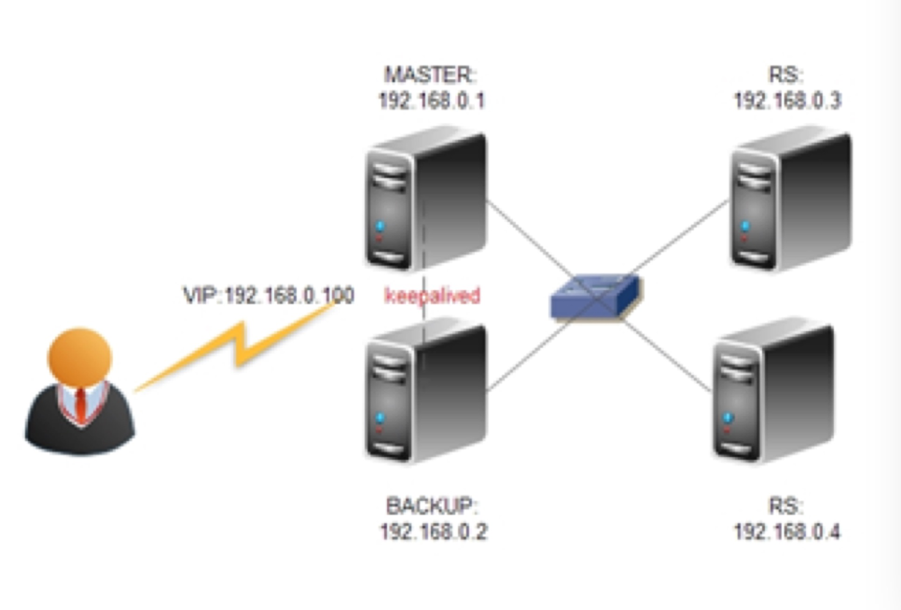

## lvs+keepalived部署

#### 背景

		
	随着公司的网站业务量的增长你网站的服务器压力越来越大？需要负载均衡方案！商业的硬件如F5又太贵，
	
	公司又是创业型互联公司如何有效节约成本，节省不必要的浪费？同时实现商业硬件一样的高性能高可用的功能？
	
	有什么好的负载均衡可伸张可扩展的方案吗？答案是肯定的！有！
	
	我们利用LVS+Keepalived基于完整开源软件的架构可以提供一个负载均衡及高可用的服务器。	
		
		
		

- LVS+Keepalived 介绍

		
		1.	LVS
		
			LVS是Linux Virtual Server的简写，意即Linux虚拟服务器，是一个虚拟的服务器集群系统。
			
			本项目在1998年5月由章文嵩博士成立，是中国国内最早出现的自由软件项目之一。
			
			目前有三种IP负载均衡技术（VS/NAT、VS/TUN和VS/DR）；
			
			八种调度算法（rr,wrr,lc,wlc,lblc,lblcr,dh,sh）。
		
		2.	Keepalvied
		       
			   Keepalived在这里主要用作RealServer的健康状态检查以及LoadBalance主机和BackUP主机之间failover的实现
		
		
		
		
		
	
- 网站负载均衡拓朴图

				
	1 +-------------VIP(192.168.0.100)-----------------+
	
	2 server(MASTER) <----keepalived----> server(BACKUP)
	
	3 (192.168.0.1)                       (192.168.0.2)
	
	
	IP规划：
	
		Hostname          	ip
		
		VIP					192.168.1.222
		
		MASTER            	192.168.1.202
		
		BACKUP            	192.168.1.204
		
		REALSERVER1       	192.168.1.203
		
		REALSERVER2       	192.168.1.201
	
				
				
				

- 部署步骤

		
		安装LVS和Keepalvied软件包
		
		1. 下载相关软件包
		
		#mkdir /usr/local/src/lvs
		       #cd /usr/local/src/lvs
		       #wget http://www.linuxvirtualserver.org/software/kernel-2.6/ipvsadm-1.24.tar.gz
		       #wget http://www.keepalived.org/software/keepalived-1.1.15.tar.gz
			   
		2. 安装LVS和Keepalived 
		
		#lsmod |grep ip_vs
		        #uname -r
		        2.6.32-279.el6.x86_64
		        #yum install kernel-devel
		        #yum -y install popt*
		#yum -y install libnl*
		#yum -y install openssl*
		        #ln -s /usr/src/kernels/2.6.32-279.9.1.el6.x86_64/ /usr/src/linux
				
		        #tar zxvf ipvsadm-1.24.tar.gz
		        #cd ipvsadm-1.24
		        #make && make install
		        #find / -name ipvsadm  # 查看ipvsadm的位置
				
		        #tar zxvf keepalived-1.1.15.tar.gz
		        #cd keepalived-1.1.15
		        #./configure  && make && make install
		        #find / -name keepalived  # 查看keepalived位置                
    			
		        #cp /usr/local/etc/rc.d/init.d/keepalived /etc/rc.d/init.d/
		        #cp /usr/local/etc/sysconfig/keepalived /etc/sysconfig/
		        #mkdir /etc/keepalived
		        #cp /usr/local/etc/keepalived/keepalived.conf /etc/keepalived/
		        #cp /usr/local/sbin/keepalived /usr/sbin/
		        #service keepalived start|stop     #做成系统启动服务方便管理.
				
				
		3.配置LVS-DR脚本.
		#!/bin/bash
		# description: start LVS of DirectorServer
		#Written by : ce
		VIP=172.16.0.250
		RIP1=172.16.0.204
		RIP2=172.16.0.205
		. /etc/rc.d/init.d/functions
		logger $0 called with $1
		
		case "$1" in
		
		start)
		           # set squid vip
		           /sbin/ifconfig eth0:0 $VIP broadcast $VIP netmask 255.255.255.255 up
		           /sbin/route add -host $VIP dev eth0:0
				   
		       ;;
		stop)
		           ifconfig eth0:0 down
		           route del $VIP
		           echo "lvs_dr stoped"
		           ;;
				   
		*)
		          echo "Usage: $0 {start|stop}"
		           exit 1
		esac
		
		4.配置Realserver脚本.
		        #!/bin/bash
		#description Config LVS to realserver lo and apply noarp
		#Written by ce
		
		VIP=172.16.0.250
		. /etc/init.d/functions
		
		case "$1" in
		        start)
		               ifconfig lo:0 $VIP netmask 255.255.255.255 broadcast $VIP
		               /sbin/route add -host $SNS_VIP dev lo:0
		               echo "1" >/proc/sys/net/ipv4/conf/lo/arp_ignore
		               echo "2" >/proc/sys/net/ipv4/conf/lo/arp_announce
		               echo "1" >/proc/sys/net/ipv4/conf/all/arp_ignore
		               echo "2" >/proc/sys/net/ipv4/conf/all/arp_announce
		               sysctl -p >/dev/null 2>&1
		               echo "RealServer Start OK"
					   
		               ;;
		        stop)
		               ifconfig lo:0 down
		               route del $VIP >/dev/null 2>&1
		               echo "0" >/proc/sys/net/ipv4/conf/lo/arp_ignore
		               echo "0" >/proc/sys/net/ipv4/conf/lo/arp_announce
		               echo "0" >/proc/sys/net/ipv4/conf/all/arp_ignore
		               echo "0" >/proc/sys/net/ipv4/conf/all/arp_announce
		               echo "RealServer Stoped"
		               ;;
		        *)
		               echo "Usage: $0 {start|stop}"
		               exit 1
		        esac
				
		        exit 0     
				
		5.利用Keepalvied实现负载均衡和和高可用性
		
		1.配置在主负载均衡服务器上配置keepalived.conf
		
		#vi /etc/keepalived/keepalived.conf
		  ! Configuration File for keepalived
		  
		global_defs {
		  router_id LVS_DEVEL
		}
		
		 # VIP1
		vrrp_instance VI_1 {
		    state MASTER             #备份服务器上将MASTER改为BACKUP   
		    interface eth0
		    virtual_router_id 51
		    priority 100    # 备份服务上将100改为99
		    advert_int 1
		    authentication {
		        auth_type PASS
		        auth_pass 1111
		    }
		    virtual_ipaddress {
		        192.168.0.100   
		        #(如果有多个VIP，继续换行填写.)
		    }
		}
		
		virtual_server 192.168.0.100 80 {
		    delay_loop 6                  #(每隔10秒查询realserver状态)
		    lb_algo wrr                  #(lvs 算法)
		    lb_kind DR                  #(Direct Route)
		    persistence_timeout 60        #(同一IP的连接60秒内被分配到同一台realserver)
		    protocol TCP                #(用TCP协议检查realserver状态)
			
		    real_server 192.168.0.3 80 {
		        weight 3               #(权重)
		        TCP_CHECK {
		        connect_timeout 10       #(10秒无响应超时)
		        nb_get_retry 3
		        delay_before_retry 3
		        connect_port 80
		        }
		    }
		    real_server 192.168.0.4 80 {
		        weight 3
		        TCP_CHECK {
		        connect_timeout 10
		        nb_get_retry 3
		        delay_before_retry 3
		        connect_port 80
		        }
		     }
		}
    		
		2. BACKUP服务器同上配置，先安装lvs再按装keepalived,仍后配置/etc/keepalived/keepalived.conf，只需将红色标示的部分改一下即可
		
		3. 启动keepalived
		
		#/etc/init.d/keepalived start  启动keepalived 服务，
		
		keepalived就能利用keepalived.conf 配置文件，实现负载均衡和高可用
		
		整个LVS负均衡HA方案，由keepalived.conf一个文件即可搞定！
		
		4. 查看lvs服务是否正常
		
		# watch ipvsadm –ln
		
		IP Virtual Server version 1.2.1 (size=4096)
		Prot LocalAddressort Scheduler Flags
		  -> RemoteAddressort           Forward Weight ActiveConn InActConn
		TCP  61.164.122.8:80 wrr persistent 60
		  -> 61.164.122.10:80            Route   3      0          0
		  -> 61.164.122.9:80             Route   3      0          0
		#tail –f /var/log/message  监听日志，查看状态。
		
		
		
		
